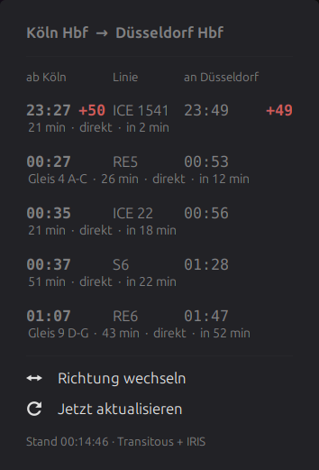

# Commute

A panel applet for the Cinnamon desktop. It shows the next train connections
between two German railway stations, together with the delay, the platform and
the number of transfers. You can change the direction with one click, and the
list always starts at the current time.



## What the applet shows

The panel shows the next departure from your start station. The text starts
with `ab`, and the station name that follows is the station where you get on
the train. A delay of one minute or more appears after the time. Small delays
are amber, and delays above your threshold are red. A cancelled train gets a
warning sign.

The menu shows the next connections in a table. Each row gives the scheduled
departure, the real departure, the line, the scheduled arrival and the real
arrival. A real time appears only when the train is late, and it is red. The
column header names the station above both of its times. The second line of each row
gives the platform, the travel time, the number of transfers, and the time
until departure. The column headers name the station that each time belongs to,
so you cannot confuse a departure with an arrival.

The list is not tied to a fixed hour. Trains that have left drop out of the
list every 20 seconds, without a new request to the servers.

## Data sources

The applet uses two independent services, and each one does what it is best at.

**Transitous** plans the journey. It finds the connections between the two
stations, and it handles transfers. Transitous runs the MOTIS routing engine on
open GTFS and GTFS-RT feeds. For Germany these feeds come from DELFI.

**db-infoscreen** supplies the departure data at your start station. It reads
IRIS, which is the internal system of Deutsche Bahn. The delays there are more
accurate and arrive earlier than the delays in the open feeds. The platform
numbers are the numbers that you see at the station.

An arrival cannot be punctual when the departure is late and the journey is
too short to recover the delay. The departure delay comes from IRIS, and the
arrival prognosis comes from MOTIS, so the two can disagree. The applet
replaces the arrival only when the recovery is impossible, and it marks such a
value with the prefix `≈`.

The applet keeps the platform number from db-infoscreen only. MOTIS gives
internal DELFI codes at some stations, for example `77` at Leverkusen Opladen.
No platform sign at that station shows this number. An empty platform column is
better than a wrong one.

If db-infoscreen does not answer, the applet continues with the Transitous
data. You then see the connections without a platform, and with the delay from
the open feed.

## Requirements

- Cinnamon 6.0 or later. The applet is tested on Cinnamon 6.6 (Linux Mint 22.3)
- Python 3.9 or later, for the `zoneinfo` module
- An internet connection

The applet needs no API key and no account.

## Installation

1. Clone the repository:

   ```bash
   git clone https://github.com/well0nez/cinnamon-commute.git
   ```

2. Link the applet directory into the Cinnamon applet path:

   ```bash
   ln -s "$PWD/cinnamon-commute/commute@well0nez" ~/.local/share/cinnamon/applets/
   ```

3. Add the applet to a panel. Right-click the panel, select *Applets*, then
   find *Commute* in the list and add it.

A link keeps the applet and the repository in one place, and `git pull` updates
the installation. If you prefer a copy, copy the `commute@well0nez` directory
instead of the link.

## Configuration

Right-click the applet and select *Configure*.

| Setting | What it does |
| --- | --- |
| Bahnhof A / Bahnhof B | The two stations. Write the name as it appears in the timetable, for example `Köln Hbf` or `Solingen-Ohligs`. |
| Verbindungen im Menü | How many connections the menu shows. |
| Panel-Text | The format of the panel text. Every format starts with `ab`, because the time is always a departure. |
| Verspätung ab dieser Höhe rot | The threshold in minutes for the red colour. Below it a delay is amber. |
| Abfrageintervall | The time between two requests. The lowest value is 60 seconds. |

The menu entry *Richtung wechseln* swaps the two stations. The applet keeps the
direction until you change it again.

The station name goes to the geocoder once. The applet then keeps the result,
and later requests use the stored identifier.

## Request limits

Both services are free, and volunteers operate them. db-infoscreen states its
limits directly:

> Bitte maximal 10 Anfragen pro Minute und insbesondere nur eine Anfrage pro
> Station und Minute.

The applet holds these limits, and it does so in three ways. The lowest
interval in the settings is 60 seconds. A cache per station blocks a second
request to the same station inside 60 seconds, even when you switch the
direction quickly. The search for the correct station name stops at the first
board that knows one of your trains.

Keep the default interval. A shorter interval gives you no new data, because
the backend data has no better resolution.

If you need many requests, host your own db-infoscreen instance. The AGPL
licence permits this, and the project documents the procedure.

## Known limitations

The IRIS departure board covers about two hours. A connection that departs
later shows no platform, and its delay comes from the open feed.

IRIS keeps two separate boards for some stations. Leverkusen Opladen is one
example: the board `Opladen` holds the RB48 and the RE7, and the board
`Leverkusen Opladen` holds the RE1, the RE5 and the S6. The applet compares
train numbers to find the correct board, and it stores the result.

The applet reads Deutsche Bahn data through IRIS. Deutsche Bahn does not
license this interface for public use, but it tolerates db-infoscreen, which
has operated since 2011. This is a risk that you accept when you use the
applet.

## References

The applet builds on these projects and data sources.

| Project | What it gives | Licence |
| --- | --- | --- |
| [Transitous](https://github.com/public-transport/transitous) | The public routing service at `api.transitous.org` | Code CC0-1.0 |
| [MOTIS](https://github.com/motis-project/motis) | The routing engine behind Transitous | MIT |
| [db-infoscreen](https://github.com/derf/db-fakedisplay) ([Codeberg](https://codeberg.org/derf/db-infoscreen)) | The departure boards from IRIS, through the `version=3` JSON API | AGPL-3.0 |
| [Travel::Status::DE::IRIS](https://finalrewind.org/projects/Travel-Status-DE-IRIS/) | The IRIS client that db-infoscreen uses | AGPL-3.0 |
| [DELFI](https://www.delfi.de/) via [mobilithek.info](https://mobilithek.info/) | The German GTFS and GTFS-RT feeds | CC-BY-4.0 and CC-BY-SA-4.0 |
| [Cinnamon](https://github.com/linuxmint/cinnamon) | The desktop and its applet interface | GPL-2.0-or-later |

Two more projects belong in this list, although the applet does not use them.
[db-vendo-client](https://github.com/public-transport/db-vendo-client) and
[db-rest](https://github.com/derhuerst/db-rest) speak to the current Deutsche
Bahn APIs. The hosted instance at `v6.db.transport.rest` answered with HTTP 503
during development, and the project itself warns about irregular blocks.
[db-hafas](https://github.com/public-transport/db-hafas) is the older client;
Deutsche Bahn shut the HAFAS interface down.

Please give attribution to DELFI and to db-infoscreen if you show this data in
your own work. The CC-BY licence requires it.

## Disclaimer

This is an unofficial project. It has no connection to Deutsche Bahn AG, to
DELFI e.V., or to any transport operator. The names and the marks belong to
their owners.

## Licence

GPL-3.0-or-later. See [LICENSE](LICENSE).
